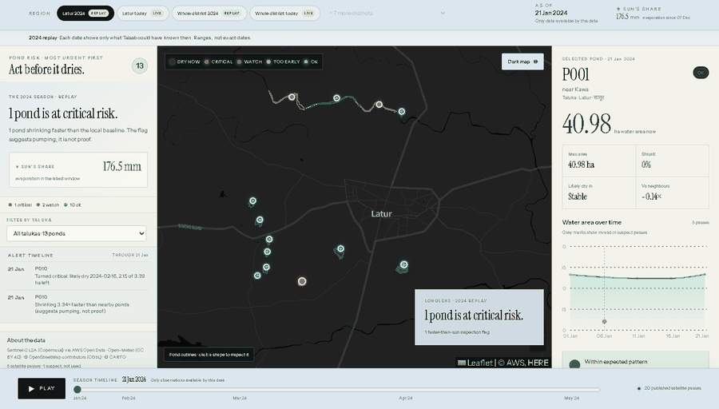
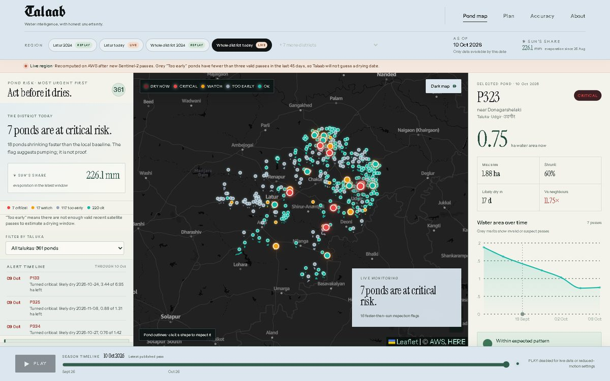
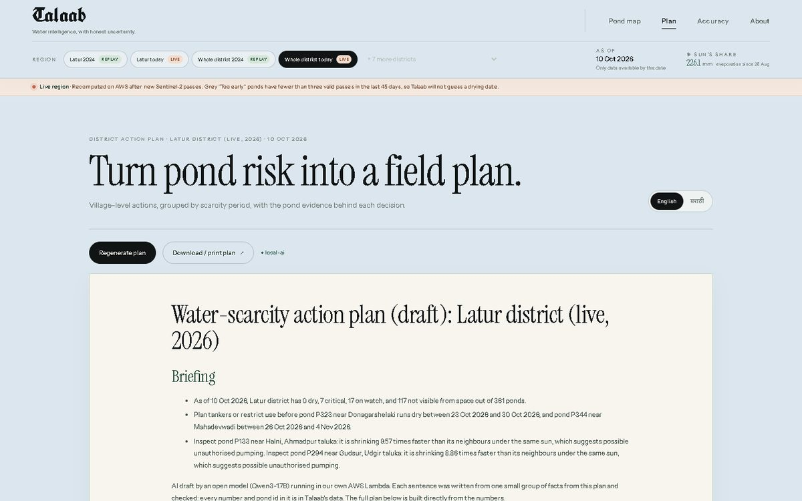
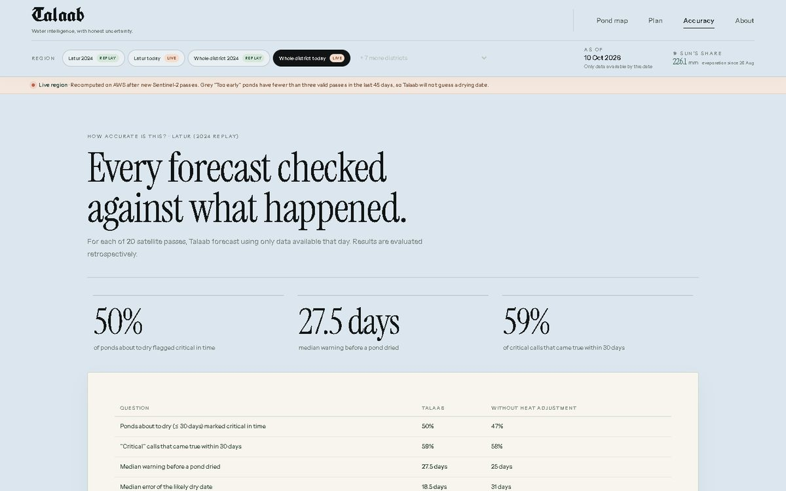

# Talaab (तालाब, "pond"): *The sun drinks first*

[](https://github.com/shloknarvekar/talaab/actions/workflows/ci.yml)

Per-pond "dry-by" countdowns and pumping flags for drought districts, built from free Sentinel-2 satellite data on AWS.

> Team **Syntax Errors**, WeMakeDevs x AWS *Environmental Hacks* hackathon (Heat & Water track), Oct 2026.

**Live site: https://main.duvnkrxj02sz1.amplifyapp.com** (AWS Amplify) · API: `https://kbvkerr0kc.execute-api.us-west-2.amazonaws.com`



*The 2024 drought season in Latur, replayed one satellite pass at a time. Each date uses only what was known on that day.*

## Results at a glance

| | Result | Where it comes from |
|---|---|---|
| **Live coverage** | All 8 drought districts of Marathwada: 64,915 km², **2,712 ponds** in 76 talukas, re-measured from satellite every 5 days in under 20 minutes | `talaab-marathwada` on AWS, [`docs/scale-projection.md`](docs/scale-projection.md) |
| **Critical calls that came true** | **70%** on a whole district (Latur 2024, 435 ponds) · **66%** on a season we never tuned on (2023) | [`docs/backtest-latur-district-2024.md`](docs/backtest-latur-district-2024.md), [`docs/backtest-latur-2023.md`](docs/backtest-latur-2023.md) |
| **Ponds that dried and were warned in time** | **60%** (2024 district) · **62%** (2023): about 4 in 10 are still missed | same backtests |
| **Median warning** | **25 days** before a pond dried | same backtests |
| **Dry date inside our range** | **40%** (2024 district) · **33%** (2023), median error of the likely date 9 days: the ranges are still too narrow for many ponds | same backtests |
| **It says how sure it is** | High-confidence critical calls were right 73% of the time, low-confidence ones 57% (2024 district); lists lead with the trusted ones | [`docs/data-quality.md`](docs/data-quality.md) |
| **Pumping flag, checked on days it never saw** | Flagged ponds lost **23.8%** of their full area over the next 30 days vs 14.0% for the rest, and **86%** dried within 60 days vs 25% (2024 district; same pattern in 2023). It can't tell *why* a pond loses water, so it only suggests an inspection | [`docs/flag-check.md`](docs/flag-check.md) |
| **Known weak spot** | Big tanks were predicted to dry too early 9 times in 2024 | [`docs/model-experiment.md`](docs/model-experiment.md) |
| **AWS cost** | **$0** so far (free tier); a whole-Marathwada run is about $0.14 of Lambda without it | AWS Cost Explorer |

| The live district map | The plan, with its AI briefing |
|---|---|
|  |  |
| **Accuracy, scored against what happened** | **Landing page** |
|  |  |

## The problem

On 25 Sep 2026 Maharashtra declared drought in 265 of its 358 talukas. Every district has to finalise a water-scarcity action plan by 15 Oct, split into Oct–Dec, Jan–Mar and Apr–Jun, and crack down on unauthorised water extraction. Villages depend on small ponds and tanks that shrink all through the dry season. In Latur between January and mid-June 2024, the sun could evaporate about **1 metre** of open water (Open-Meteo ET0 ≈ 974 mm), while only about **43 mm** of rain fell from January to May. Government maps track small ponds only seasonally, and nobody gives a district a countdown for each pond.

## How it works

1. **Find ponds.** Sentinel-2 imagery, free on AWS with a new pass about every 5 days, locates every pond in the district automatically.
2. **Measure.** Each pond's water area is measured on every clear pass, and noisy passes are cleaned out.
3. **Two checks per pond:**
   - **Countdown:** a dry-by date *range* (earliest, likely, latest) from the shrink trend, adjusted for expected heat.
   - **Faster than the sun:** a pond shrinking much faster than its neighbours under the same sun is flagged for inspection (likely pumping).
4. **By taluka, and for the whole division.** Drought is declared per taluka, so every pond is placed in its taluka (all 76 in Marathwada, from OpenStreetMap boundaries). The Divisional Commissioner gets one view of all 8 districts (`GET /division`): which districts and talukas need tankers first, the most urgent ponds and which to inspect, what changed since the last run, plus a division plan in English and Marathi.
5. **AI briefing on the plan.** Every district and the division get a quarterly scarcity plan in English and Marathi built from our numbers, and an AI briefing on top: an open model (Qwen3-1.7B) **running inside our own AWS Lambda** writes it sentence by sentence, and every sentence is checked against the data before it is shown. (The full Claude-on-Bedrock plan writer is built too and switches on once AWS enables Bedrock on our new account.)
6. **Automatic.** The analysis re-runs every 5 days on AWS.

The demo replays **Latur, Jan–Jun 2024** as an honest backtest: each "as of" date uses only the data available up to that date.

**Whole district, on AWS.** All of Latur district (7,157 km², **435 ponds**) runs on AWS Step Functions + Lambda: a whole 26-pass season with a satellite thumbnail for every reading in **under 10 minutes for $0** inside the free tier ($0.07 without it; 6 cells at a time, so the website always keeps Lambdas free). On those 435 ponds, 70% of critical calls came true and the median warning was 25 days. **And live, for all of Marathwada:** every 5 days EventBridge Scheduler re-runs all 8 drought districts of Marathwada (64,915 km², 403 grid cells, **2,712 ponds** in 76 talukas, with a satellite thumbnail for every reading) in about 19 minutes for $0, and sends **one** digest email for the division about ponds that newly need action. Projection to Maharashtra and India, with an honest list of what would change: [`docs/scale-projection.md`](docs/scale-projection.md).

## Honest by design

- **Ranges, not fake dates.** Every pond gets an earliest–likely–latest dry-by range. A pond whose shrinking is within measurement noise is called *stable*; we don't invent a date.
- **Replays can't see the future.** Each as-of snapshot is built only from satellite passes and weather available on that day, so the 2024 replay is a real backtest.
- **Validated on an unseen season.** All rules were built on 2024; on the held-out 2023 season Talaab still flagged 62% of ponds about to dry in time (25-day median warning, 66% of critical calls right). See [`docs/model-experiment.md`](docs/model-experiment.md).
- **Proof, not claims.** [`docs/backtest-*.md`](docs/) scores every past prediction against what actually happened: dry dates inside our range, days of warning, false and missed alarms. It also runs with the heat adjustment switched off for comparison.
- **The AI can't invent numbers.** The briefing model sees one small group of facts per sentence; each sentence is rejected (and re-written, or left out) if it has a number, date, pond id or place name that isn't in those facts, names the wrong taluka first, or states pumping as fact. The Bedrock writer has the same *number guard*.
- **It tells you; you don't have to check.** After each 5-day run, Amazon SNS sends **one** digest email for the whole division: every district's state, the talukas needing action first, and the ponds that *newly* turned critical, dried up, or started shrinking faster than the sun. There are no repeats, and every number comes from the data.
- **Officials' language and structure.** Plans come in English and Marathi, with one section per scarcity period (Oct–Dec, Jan–Mar, Apr–Jun) as the state order requires, a table by village and a concrete action per pond.

## Architecture (AWS, us-west-2)

Full diagram and flow: **[docs/architecture.md](docs/architecture.md)**.

| AWS service | Role |
|---|---|
| **S3** | Pipeline measurements, per-date snapshots, cached plans, backtest |
| **Lambda** (×8) | `pipeline-grid` + `pipeline-cell` + `pipeline-merge` (satellite pipeline), `api`, `recompute`, `plan-llm` (open-model AI briefing), `plan-worker` (Strands Agents, for Bedrock), `hello` |
| **Step Functions** | `talaab-district`: grid → one Lambda per 0.15° cell (42 for Latur, 6 in parallel) → merge; `talaab-marathwada` runs it for all 8 districts every 5 days |
| **API Gateway** (HTTP API) | Public API, throttled, gzip; also serves district imagery (signed S3 links) |
| **EventBridge Scheduler** | Every 5 days (one Sentinel-2 revisit): re-measure all of Marathwada from satellite, and recompute every region |
| **DynamoDB** | Latest state of every pond, kept current by each recompute; `GET /ponds/{id}` (latest) reads one item from it instead of a whole district file |
| **Amazon SNS** | One digest email per run for the division (new critical, dry or flagged ponds), plus ops alarms |
| **AWS Lambda (AI)** | `talaab-plan-llm`: Qwen3-1.7B with llama.cpp on the Lambda CPU writes the checked briefing; briefings are pre-written after each run and cached in S3 |
| **Amazon Bedrock** | Built and tested (Claude via Strands Agents writes the whole plan); waiting for AWS to enable Bedrock on our new account |
| **CloudWatch** | Logs, the `talaab-ops` dashboard, and 6 alarms (failed runs, Lambda errors, API 5xx) emailed via SNS `talaab-ops` |
| **AWS X-Ray** | Traces every Lambda and both Step Functions workflows |
| **Amazon Location Service** | The web map's dark basemap and satellite layer (key locked to our site) |
| **Amplify Hosting** | The web map |
| **AWS Open Data** | Sentinel-2 L2A imagery, read straight from S3 |

## Repo layout

| Folder | What |
|---|---|
| `pipeline/` | Satellite pipeline: STAC search, water mask, pond detection, cleanup, evaporation |
| `backend/` | Countdown, flags, snapshots, backtest (`logic/`), API (`api/`), recompute job (`jobs/`), plan agent (`agent/`), SAM template, scripts, 65 tests |
| `web/` | Vite + React + Leaflet map |
| `data/` | Measurements and snapshots per region (`latur-2024`, `latur-2026`, `latur-2024-synthetic` test data) |
| `docs/` | Data contract, demo script, architecture, sources |

## Live API (AWS, us-west-2)

Base URL: `https://kbvkerr0kc.execute-api.us-west-2.amazonaws.com`

| Call | Returns |
|---|---|
| `GET /regions` | Regions with data (2024 replay, live 2026, synthetic test data) and the exact dates available |
| `GET /ponds?region=latur-2024&asOf=2024-03-26` | Full `ponds.json` ([contract](docs/data-contract.md)); `asOf` resolves to the latest snapshot on or before that date |
| `GET /ponds/P003?region=latur-2024&asOf=2024-03-26` | One pond |
| `POST /plan` `{"region":"latur-2024","asOf":"2024-03-26","language":"mr"}` | `{markdown, pondIds, source, status}`. Instant template plan; the AI version arrives on a later call (`status: ready`, `source: local-ai`) |
| `GET /backtest?region=latur-2024` | How well past predictions matched reality |

```bash
curl "https://kbvkerr0kc.execute-api.us-west-2.amazonaws.com/regions"
python backend/scripts/smoke_test.py   # checks every endpoint
```

## Setup

```bash
# backend tests (no AWS needed; the same install as CI)
pip install -r backend/requirements-dev.txt -r backend/scripts/requirements.txt -r backend/agent/requirements.txt
cd backend && python -m pytest

# satellite pipeline tests
pip install -r pipeline/requirements.txt && python -m pytest pipeline/tests

# deploy (needs AWS CLI + SAM CLI + credentials)
cd backend && sam build && sam deploy

# AI writer: local open model in Lambda (what runs today), or Bedrock; build the layer, then deploy
python backend/scripts/build_layer.py --name llm-layer   # llama.cpp; needs `pip install uv`; no Docker
cd backend && sam build && sam deploy --parameter-overrides PlanAI=local   # on = Bedrock (strands-layer), off = template only
aws lambda invoke --function-name talaab-plan-llm --payload '{"action":"fetch-model"}' --cli-binary-format raw-in-base64-out out.json  # once: model -> S3

# publish pipeline output: checks it, uploads measurements.json and recomputes that region on AWS
pip install -r backend/scripts/requirements.txt
python backend/scripts/check_measurements.py data/latur-2024/measurements.json
python backend/scripts/upload_measurements.py data/latur-2024/measurements.json

# whole district on AWS: build the pipeline layer + function, deploy, then run (Step Functions)
python backend/scripts/build_layer.py --name pipeline-layer
python backend/scripts/stage_pipeline_fn.py
python backend/scripts/run_district.py --wait                               # 2024 replay
python backend/scripts/run_district.py --region latur-district-2026 --wait  # live season (what the schedule runs)

# backtest report (docs/backtest-<region>.md + GET /backtest)
python backend/scripts/run_backtest.py data/latur-2024/measurements.json --upload

# publish the web map on AWS Amplify (builds web/, uploads, prints the URL)
python backend/scripts/deploy_web.py

# tear everything down after judging
cd backend && sam delete
```

## Data credits

- **Sentinel-2 L2A**: contains modified Copernicus Sentinel data 2024, accessed via the [AWS Open Data Registry](https://registry.opendata.aws/sentinel-2-l2a-cogs/) and the Element 84 Earth Search STAC API.
- **Open-Meteo**: weather data (ET0, precipitation) from [Open-Meteo.com](https://open-meteo.com/), licensed CC BY 4.0.
- **OpenStreetMap**: village names and taluka boundaries for each pond (and the map basemap): © OpenStreetMap contributors, ODbL 1.0.
- **Pond thumbnails and outlines** in the web app are cut from the same Sentinel-2 L2A true-colour images (`pipeline/imagery.py`).
- **Optional basemaps**: CARTO Dark Matter (only with `VITE_CARTO_API_KEY`) and the Esri World Imagery satellite layer (Esri, Maxar, Earthstar Geographics).

## AI tools used

- **Claude Code** (Anthropic): backend logic and tests, AWS SAM templates, scripts, docs (pair-programmed with the team).
- **Qwen3-1.7B** (Alibaba Qwen, Apache-2.0; GGUF by Unsloth) with **llama.cpp** / llama-cpp-python (MIT), running in AWS Lambda: in-product briefing writer.
- **Amazon Bedrock** (Claude) via **Strands Agents SDK**: full plan writer, built and tested, waiting for Bedrock access.

## License

MIT, see [LICENSE](LICENSE).
