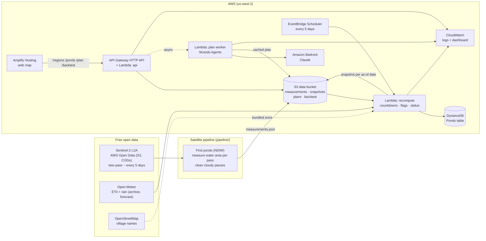

# Talaab architecture

Everything runs serverless in **AWS us-west-2** (the same region as the Sentinel-2 open data),
deployed from one SAM template ([`backend/template.yaml`](../backend/template.yaml)). Nothing has
an hourly cost while idle.

## Flow, step by step

1. **Measure (pipeline).** On a laptop, the pipeline reads Sentinel-2 windows straight from AWS
   Open Data. It finds ponds on the reference pass with NDWI, measures each pond's water area on
   every clear pass and marks cloudy or noisy passes invalid. The output is `measurements.json`
   ([contract](measurements-contract.md)).
2. **Upload.** `backend/scripts/upload_measurements.py` checks the file, puts it in S3 and starts
   the recompute right away.
3. **Recompute (every 5 days, plus on upload).** For each region, the Lambda:
   - names ponds after the nearest OSM village, in English and Marathi;
   - for the live region, adds observed and 16-day forecast heat from Open-Meteo;
   - builds one `ponds.json` snapshot for every pass date, using only data up to that date;
   - writes the snapshots to S3 and each pond's latest state to DynamoDB.
4. **Serve.** The API Lambda serves regions, snapshots, single ponds, plans and the backtest. A
   date between passes resolves to the latest snapshot on or before it, so a replay never shows
   the future.
5. **Plan.** `POST /plan` answers instantly with a deterministic English/Marathi plan. When AI is
   on, it also starts the plan worker asynchronously, because API Gateway allows only 30 s. The
   worker runs a Strands agent on Bedrock whose tools are locked to that one snapshot. The draft
   must pass the **number guard** (every number must exist in our data; one retry). It is then
   cached in S3, so each date and language is paid for once.
6. **Observe.** Every Lambda logs one JSON line per action to CloudWatch, and the
   `talaab-ops` dashboard shows traffic, errors, durations and the latest recompute runs.

## Why it is built this way

| Choice | Reason |
|---|---|
| Deterministic maths, AI only for wording | Officials must be able to trust the numbers; the AI can't invent any |
| Ranges, never one date | A dry-by date is a forecast; the range is honest about uncertainty |
| Snapshot per as-of date | Backtests and replays can't see the future, by construction |
| Template plan first, AI plan async | Instant answer, 30 s API limit respected, demo works without AI |
| Satellite step on a laptop | No Docker or container build needed; AWS still re-runs every 5 days |
| Serverless, on-demand only | Costs pennies, nothing bills while idle |

## Cost guards

- API throttling: about 20 requests/s overall and about 2 requests/s on `POST /plan`.
- AI plans cached per snapshot and language; the worker never retries automatically.
- AI switch: `sam deploy --parameter-overrides PlanAI=off` serves template plans only.
- Logs kept 14 days; DynamoDB on-demand; arm64 Lambdas.
- Teardown after judging: `cd backend && sam delete` (empty the data bucket first).
