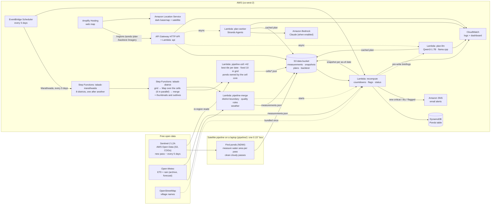

# Talaab architecture

Everything runs serverless in **AWS us-west-2** (the same region as the Sentinel-2 open data),
deployed from one SAM template ([`backend/template.yaml`](../backend/template.yaml)). Nothing has
an hourly cost while idle.

## Flow, step by step

1. **Measure (pipeline).** A whole district runs on AWS: `backend/scripts/run_district.py` starts the
   Step Functions state machine `talaab-district`, which runs one `pipeline-cell` Lambda per 0.15° grid
   cell (42 cells for Latur, 6 at a time, each retried twice). Each cell picks, for every date, the
   Sentinel-2 tile that covers it best, reads it onto one fixed 10 m grid, and keeps only the ponds whose
   centre is in its core (cells overlap by ~1.6 km, so edge ponds are seen whole and counted once).
   `pipeline-merge` keeps ponds inside the OSM district boundary, applies the quality rules and adds
   weather; Latur district (435 ponds) takes 161 s and costs $0 inside the free tier. The single
   validated box can also be run on a laptop: the pipeline reads Sentinel-2 windows straight from AWS
   Open Data. It finds ponds on the reference pass with NDWI, measures each pond's water area on
   every clear pass and marks cloudy or noisy passes invalid. The output is `measurements.json`
   ([contract](measurements-contract.md)).
2. **Upload.** `backend/scripts/upload_measurements.py` checks the file, puts it in S3 and starts
   the recompute right away.
3. **Recompute (every 5 days, plus on upload).** For each region, the Lambda:
   - names ponds after the nearest OSM village, in English and Marathi;
   - for the live region, adds observed and 16-day forecast heat from Open-Meteo;
   - builds one `ponds.json` snapshot for every pass date, using only data up to that date;
   - writes the snapshots to S3 and each pond's latest state to DynamoDB;
   - for live districts, queues new critical, dry or flagged ponds; the Digest step at the end of the
     `talaab-marathwada` run (and the scheduled recompute) sends ONE email for the whole division, and every
     district's alert history records what was sent;
   - writes the division summary (`GET /division`): every district, the talukas needing action first, the most
     urgent ponds, the inspection list, and what changed since the run before (each district vs its snapshot
     ~5 days earlier). District outlines for the division map come from `GET /division/outlines`.
4. **Serve.** The API Lambda serves regions, snapshots, single ponds, plans and the backtest. A
   date between passes resolves to the latest snapshot on or before it, so a replay never shows
   the future.
5. **Plan.** `POST /plan` answers instantly with a deterministic English/Marathi plan and, for the AI
   version, starts a worker asynchronously (API Gateway allows only 30 s); the result is cached in S3, so
   each date and language is written once. Today (`PlanAI=local`) the worker is `talaab-plan-llm`: an open
   model (Qwen3-1.7B, 4-bit) with llama.cpp on the Lambda CPU writes a briefing one sentence per small group
   of facts, and `agent/briefing.py` checks each sentence (numbers, dates, pond ids, place names, order,
   hedged pumping) before it is used. Only one runs at a time (S3 lock), and recompute pre-writes the
   division's and each live district's briefing after every full run. With Bedrock (`PlanAI=on`) the worker
   runs a Strands agent whose tools are locked to one snapshot, behind the **number guard**.
6. **Observe.** Every Lambda logs one JSON line per action to CloudWatch, and the
   `talaab-ops` dashboard shows traffic, errors, durations and the latest recompute runs.

## Why it is built this way

| Choice | Reason |
|---|---|
| Deterministic maths, AI only for wording | Officials must be able to trust the numbers; the AI can't invent any |
| Ranges, never one date | A dry-by date is a forecast; the range is honest about uncertainty |
| Snapshot per as-of date | Backtests and replays can't see the future, by construction |
| Template plan first, AI plan async | Instant answer, 30 s API limit respected, demo works without AI |
| District pipeline on Lambda + Step Functions | Reads imagery next to the data (26–50 s per cell vs 447 s on a laptop), scales by adding cells, no servers or Docker (layer built with `uv`) |
| Serverless, on-demand only | Costs pennies, nothing bills while idle |

## Cost guards

- API throttling: about 20 requests/s overall and about 2 requests/s on `POST /plan`.
- AI plans cached per snapshot and language; the worker never retries automatically.
- AI switch: `sam deploy --parameter-overrides PlanAI=off` serves template plans only.
- Logs kept 14 days; DynamoDB on-demand; arm64 Lambdas.
- Teardown after judging: `cd backend && sam delete` (empty the data bucket first).
